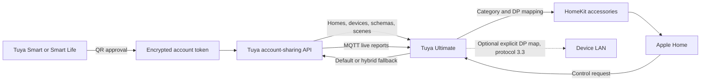

<!-- markdownlint-disable MD013 MD033 -->

<h1 align="center">Tuya Ultimate</h1>

<p align="center">
  Bring Smart Life and Tuya Smart devices into Apple Home.<br>
  QR account authorization, live cloud updates, scenes, advanced datapoint mapping, and no personal developer project required.
</p>

<p align="center">
  <a href="https://www.npmjs.com/package/homebridge-tuya-ultimate"></a>
  <a href="https://www.npmjs.com/package/homebridge-tuya-ultimate"></a>
  <a href="https://github.com/tharunpkarun/homebridge-tuya-ultimate/actions/workflows/build.yml"></a>
  
  
  <a href="LICENSE"></a>
</p>

> [!NOTE]
> The QR connection supports both **Tuya Smart** and **Smart Life**. A normal QR-only setup requires only the app's User Code and QR approval; it does not require a Tuya IoT Developer Platform project, Access ID, Access Secret, country code, username, or password. The optional product-endpoint fallback is a separate advanced mode and does require Developer Cloud credentials.

| Start here | Learn more | Get help |
| :---: | :---: | :---: |
| [🚀 Quick start](#quick-start) | [✨ Capabilities](#capabilities) | [🧰 Troubleshooting](#troubleshooting) |
| [📦 Installation](#installation) | [🏠 Supported devices](#supported-devices) | [🔐 Security](#security-and-privacy) |
| [📱 QR authorization](#qr-authorization) | [⚙️ Configuration](#configuration) | [🤝 Contribute](#development-and-contributing) |

## Why Tuya Ultimate?

Tuya devices are sold under thousands of brands and product names, but most of them expose a smaller set of standard Tuya categories and datapoints. Tuya Ultimate discovers those definitions, converts them into native HomeKit services, and keeps them updated through Tuya's cloud message stream.

The QR connection removes the most frustrating part of a traditional Tuya setup: every Homebridge user no longer needs to create, link, authorize, and periodically renew a personal Tuya cloud project. Existing `Custom` and Tuya Developer Cloud (`Smart Home`) project configurations remain supported for installations that already use them or need APIs outside the account-sharing surface.

## Connection methods

| Method | Project type | User provides | Device source | Recommended for |
| --- | :---: | --- | --- | --- |
| Smart Life / Tuya Smart QR login | `3` | App, User Code, QR approval | Homes shared with the app account | Most personal installations |
| Tuya Developer Cloud project (legacy Smart Home) | `2` | Access ID, Access Secret, country code, app login | Linked app account homes | Existing developer-project users |
| Custom cloud project | `1` | Endpoint, Access ID, Access Secret | Authorized project assets | Industry/custom Tuya projects |

> [!WARNING]
> QR mode currently uses Home Assistant's public Tuya authorization identity for compatibility. Authorizing the **same Tuya account** in both systems can replace or invalidate Home Assistant's existing Tuya refresh token. Your devices and Tuya Home are not deleted, but one integration may request reauthentication. The reliable coexistence setup is to share the Tuya Home with a second Smart Life or Tuya Smart account and use that second account only for Homebridge.

## Installation

Before installing, remove the old `homebridge-tuya-platform` package if it is present. Both plugins use compatible platform concepts but should not run against the same accessories simultaneously.

### Homebridge UI

1. Open **Homebridge UI → Plugins**.
2. Search for **Tuya Ultimate**.
3. Select **Install**.
4. Open the plugin settings and continue with [Quick start](#quick-start).

### Command line

Run this command in a terminal on the Homebridge host:

```bash
npm install -g homebridge-tuya-ultimate
```

Then restart Homebridge, open the plugin settings, and follow [Quick start](#quick-start).

### Development builds

GitHub installations track unreleased source code and are intended for testing fixes before their next npm release:

```bash
npm install -g github:tharunpkarun/homebridge-tuya-ultimate
```

## Quick start

1. Add and test the devices in **Tuya Smart** or **Smart Life** first.
2. In that app, open **Me → Settings → Account and Security → User Code** and copy the User Code.
3. Open Tuya Ultimate settings.
4. Open **Account** and select **App QR authorization**.
5. Select the exact app containing the devices and enter its User Code.
6. Select **Generate login QR code**.
7. Scan the new QR code with the selected app and approve the authorization.
8. Wait for **Authorized**, then restart Homebridge.

The plugin discovers every visible Tuya Home unless `homeWhitelist` is configured. Supported devices and enabled Tap-to-Run scenes then appear as HomeKit accessories.

> [!TIP]
> Tuya QR tokens are short-lived. If the app reports that a code has expired, select **Generate a fresh code** and scan the newly generated code. A screenshot of an earlier QR code cannot be reused.

## Reliable coexistence with Home Assistant

Use separate app accounts when Home Assistant and Homebridge need access to the same Tuya Home:

1. Keep the primary Tuya Smart or Smart Life account connected to Home Assistant.
2. Create a second account in the same app ecosystem.
3. From the primary account, invite the second account as a member of the Tuya Home.
4. Accept the invitation and confirm that the second account can see the devices.
5. Copy the **second account's User Code**.
6. Complete Homebridge QR authorization while signed in to the second account.

Both accounts then reach the same devices, while each integration owns a different account token.

## Capabilities

| Capability | Status | Notes |
| --- | :---: | --- |
| Tuya Smart QR authorization | ✅ | No personal developer project or app password |
| Smart Life QR authorization | ✅ | Uses the same secure QR approval flow |
| Home and device discovery | ✅ | Reads all visible homes or an optional whitelist |
| HomeKit accessory mappings | ✅ | Reuses the established category handlers from the official plugin |
| Device commands | ✅ | Uses the account API by default, with an explicit-DP LAN beta available per device |
| Live state updates | ✅ | MQTT subscriptions for normalized and raw datapoint reports |
| Automatic token renewal | ✅ | Refreshes and atomically persists account credentials |
| Tap-to-Run scenes | ✅ | Enabled scenes appear as HomeKit switches |
| Raw datapoint conversion | ✅ | Includes Tuya's official boolean, enum, range, light, timer, lock, vacuum, and meter conversion strategies |
| IR air-conditioner climate control | 🟡 | Compatible QR schemas expose sharing commands; exact key tables, cloud-shadow polling, and hub telemetry use Developer Cloud |
| Home whitelist | ✅ | Include only selected Tuya Home IDs |
| Device and schema overrides | ✅ | Rename datapoints, correct types/ranges, transform values, hide devices, or change categories |
| Conservative capability detection | 🟡 | Optional fallback for otherwise unsupported categories that already expose recognized standard datapoints |
| Per-device settings and support export | ✅ | QR dashboard provides explicit-save accessory options, bounded diagnostics, inert drafts, and a separately pseudonymized support bundle |
| Developer-project modes | ✅ | Existing Custom and Tuya Developer Cloud configurations remain available |
| Developer Cloud product fallback in QR mode | 🟡 | Optional secondary credentials route IR, lock, and camera product endpoints only |
| Optional weather accessory | ✅ | Open-Meteo or authorized Tuya weather data |
| Manual RTSP camera | ✅ | Add a camera stream independently of Tuya cloud discovery |
| HomeKit Secure Video recording | 🟡 | Automatic for eligible non-virtual cameras with RTSP, a real Tuya motion-event datapoint, and FFmpeg libx264/native AAC |
| Product-specific camera and lock APIs in QR mode | 🟡 | Depend on sharing permissions unless the optional Developer Cloud product fallback is configured |
| Local energy history | 🟡 | Opt-in archive of allowlisted numeric reports observed by the plugin; not an import of Tuya app history |
| Historical energy/statistics import | ➖ | Tuya app history and cloud statistics are not downloaded |
| Local Tuya LAN command routing | 🧪 | Explicit-DP protocol 3.3 beta with optional cloud fallback; discovery and live state remain cloud-based |
| Accessory cleanup backups | ✅ | Writes a minimal owner-only layout backup before stale cached accessories are removed |
| Zigbee gateway replacement | ➖ | Zigbee child devices remain paired to their Tuya gateway |

## How it works



At startup, the plugin:

1. Loads the account token from Homebridge's persist directory.
2. Refreshes it when it is within one minute of expiry.
3. Fetches homes, devices, device specifications, report strategies, and scenes.
4. Converts each Tuya device into the existing internal device model.
5. Optionally signs in to a secondary Developer Cloud project for product-specific IR, lock, and camera endpoints.
6. Resolves product-backed IR remotes and builds thermostat command profiles for compatible QR IR air conditioners.
7. Applies overrides in device, product, then global order.
8. Creates or restores stable HomeKit accessories using the Tuya device ID.
9. Backs up any stale cached accessory layouts before unregistering them.
10. Initializes opt-in energy sampling and per-device LAN command routes.
11. Opens the Tuya MQTT stream and subscribes to the selected homes and devices.

### Live datapoint reports

Tuya can send one of two report shapes:

- **Normalized reports** contain a standard datapoint code and value.
- **Raw reports** contain a numeric `dpId` and encoded value.

For raw reports, the plugin fetches Tuya's strategy metadata, converts the value, validates enum ranges, and only then updates HomeKit. Devices explicitly marked by Tuya as custom reporting types stay on normalized reporting to avoid publishing incorrectly decoded values.

MQTT credentials are short-lived. The plugin renews them before expiry, tears down the old client, and reconnects with exponential backoff after unexpected failures.

## QR authorization

### What users provide

- The app in use: `tuyaSmart` or `smartlife`
- The User Code displayed by that app
- Approval by scanning a QR code

The primary QR connection does not request the app username, password, Access ID, Access Secret, local key, or cloud data-center selection. `developerCloudFallback` is an explicit exception: enabling it adds a secondary Developer Cloud login with its own project credentials while leaving QR as the primary connection.

### Compatibility identity

The default client identity and QR schema are the public values used by Home Assistant's Tuya authorization flow. Advanced builds can override them with:

- `TUYA_SHARING_CLIENT_ID`
- `TUYA_SHARING_SCHEMA`
- `options.clientId`
- `options.qrSchema`

A new identity cannot be invented locally. Tuya must issue the client ID and enable its matching QR schema for the account-sharing endpoints.

### Credential storage

QR credentials are stored outside `config.json`:

```text
<Homebridge persist path>/TuyaSharing.<user-code-hash>.json
```

The filename contains only a shortened SHA-256 hash of the User Code. The file is written atomically with owner-only permissions (`0600`). It contains the access token, refresh token, Tuya endpoint, terminal ID, account UID, app selection, and integration client ID.

## Supported devices

Support is determined by both the Tuya category and the datapoints actually exposed by a product. Two products with the same marketing name can use different schemas.

| Family | Representative category codes | HomeKit services |
| --- | --- | --- |
| Lights and dimmers | `dj`, `dsd`, `xdd`, `fwd`, `dc`, `dd`, `gyd`, `tyndj`, `sxd`, `tgq`, `tgkg` | Lightbulb, Motion Sensor |
| Switches and relays | `kg`, `tdq`, `dlq`, `qjdcz`, `szjqr` | Switch, optional energy characteristics |
| Outlets and power strips | `cz`, `pc`, `wkcz` | Outlet, temperature/humidity where exposed |
| Wireless and scene switches | `wxkg`, `cjkg` | Stateless Programmable Switch, Switch |
| Air conditioners | `kt`, `ktkzq` | Heater Cooler, Fan, Dehumidifier, sensors |
| Heating and climate | `qn`, `wk`, `wkf`, `mjj` | Heater Cooler, Thermostat |
| Fans and ceiling fan lights | `fs`, `fsd`, `fskg` | Fan, Lightbulb |
| Curtains and windows | `cl`, `clkg`, `mc` | Window Covering, Window |
| Garage doors | `ckmkzq` | Garage Door Opener |
| Air treatment | `kj`, `jsq`, `cs`, `xxj` | Air Purifier, Humidifier, Dehumidifier, Lightbulb |
| Safety sensors | `ywbj`, `rqbj`, `jwbj`, `sj`, `cobj`, `co2bj` | Smoke, Leak, Carbon Monoxide, Carbon Dioxide |
| Emergency buttons | `sos` | Stateless Programmable Switch; battery when reported |
| Environment sensors | `wsdcg`, `ldcg`, `pir`, `hps`, `pm25`, `hjjcy`, `qxj` | Temperature, Humidity, Light, Motion, Occupancy, Air Quality |
| Security | `ms`, `jtmspro`, `mal`, `mcs`, `zd` | Lock, Security System, Contact, Motion |
| Cameras and doorbells | `sp`, `wxml` | Motion, Doorbell, optional stream |
| Valves and feeders | `ggq`, `sfkzq`, `cwwsq` | Valve, Switch |
| Electricity meters | `zndb` | Read-only Outlet with energy characteristics |
| IR hubs and remotes | `wnykq`, `hwktwkq`, `wsdykq`, `infrared_*` | Sensors, Switch, Heater Cooler, temperature and humidity |
| Scenes | Virtual `scene` devices | Switch |

See [Supported Devices](SUPPORTED_DEVICES.md) for the complete category matrix and Tuya documentation links.

> [!IMPORTANT]
> A listed category means the plugin has a matching accessory handler. The product must still expose that handler's required standard datapoints. Unsupported or non-standard products can often be corrected with [device overrides](ADVANCED_OPTIONS.md).

### Energy monitoring

Supported switches, outlets, and circuit breakers can expose current, power, voltage, and total consumption when the device schema provides the corresponding standard datapoints. The standalone `zndb` handler publishes a non-commanding, read-only Outlet service for numeric `cur_current`, `cur_power`, `cur_voltage`, `forward_energy_total`, or `add_ele` datapoints. Numeric `phase_a_*`, `phase_b_*`, and `phase_c_*` current, power, and voltage datapoints can appear as separate phase services when their schema units are safe to convert.

Raw compound phase payloads are not decoded, and reverse energy is not presented as household consumption because direction and units vary by product. Import/export accounting and calculated household totals are outside this mapping.

For a non-standard energy meter, first inspect its saved device schema and live datapoints. Use an override only when the conversion, scale, sign, and unit are known.

`options.energyHistory.enabled` separately records allowlisted numeric energy reports that the plugin observes. It does not poll the device, import Tuya app history, or change which measurements HomeKit exposes. See [Local energy history](#local-energy-history).

## Feature guides

### Tap-to-Run scenes

Enabled scenes from each selected Tuya Home are represented as HomeKit switches. Turning the switch on triggers the scene; the scene is an action and does not represent a persistent Tuya on/off state.

### Multi-gang switches

The standard switch and outlet handlers create services from the device's channel datapoints. A three-gang switch can therefore appear as multiple HomeKit services under one accessory when its schema uses standard channel codes such as `switch_1`, `switch_2`, and `switch_3`.

### Weather accessory

Enable `generateWeatherAccessory` to create a virtual weather accessory for a discovered home location.

| Weather source | Requirement | Notes |
| --- | --- | --- |
| `Open-Meteo` | Internet access | Intended for non-commercial use under Open-Meteo's terms |
| `Tuya` | Authorized Tuya Weather Service | Most relevant to developer-project modes |

### Cameras and RTSP

Tuya camera discovery can expose motion, doorbell, and product-dependent stream behavior. A separate RTSP camera can also be configured manually with `cameras[]`. If the URL does not already contain credentials, optional `username` and `password` values are inserted when the stream is opened.

HomeKit Secure Video recording is advertised automatically only when a non-virtual Tuya camera has a readable `movement_detect_pic` event datapoint, an available RTSP source, and FFmpeg reports both the `libx264` and native `aac` encoders. The RTSP source may be allocated by Tuya or overridden in `cameras[]` for that same Tuya camera. A standalone manual RTSP entry has no Tuya motion event and therefore remains live-stream-only. Apple's normal Home hub, iCloud plan, and Home recording settings still apply.

When HomeKit activates recording and selects a configuration, the plugin keeps complete fragmented-MP4 segments in memory. A motion report pins the pre-trigger buffer and subsequent fragments for up to ten seconds while HomeKit requests the event, then the delegate hands that event window into the live recording without a gap. Only the motion trigger option is advertised for HKSV, and the camera's motion service is linked; a separate HomeKit Doorbell service does not imply a recording trigger. Recording audio follows HomeKit's `RecordingAudioActive` privacy setting and restarts the rolling pipeline when that setting changes. Selected prebuffer and fragment lengths are capped at eight seconds; retained prebuffer, the bounded event window, and each slow-consumer queue are capped at 32 MiB, and the initialization segment at 4 MiB. The buffer is never written to disk and is lost after a restart, offline period, or pipeline failure; immediately after activation there may not yet be a complete fragment to prepend.

### IR control

The inherited accessory mappings cover Tuya IR hubs, learned remotes, generic remotes, and air conditioners. Through Tuya Developer Cloud, IR air conditioners appear in Apple Home as climate accessories with power, supported operating modes, and target temperature. When the physical IR hub reports `temp_current` or `humidity_current`, those live ambient readings are attached to the same HomeKit AC accessory instead of displaying placeholder zero values.

The plugin resolves each virtual IR remote against its physical hub before applying `deviceOverrides`. You can therefore hide the physical hub from Apple Home while retaining the remote's parent identity, mode table, current state, sensor readings, and command endpoint. Set `irAirConditionerPowerOnMode` on that device's override to choose what a plain Apple Home **Turn On** request means: `cool` (the default), `heat`, `auto`, or `last`. If the selected mode is unavailable on that remote, the handler chooses a supported climate mode instead.

When Developer Cloud product endpoints are available, changes made to the virtual IR air conditioner in Smart Life or Tuya Smart are reconciled when Apple Home reads its climate characteristics and after relevant Tuya cloud reports. Status reads are coalesced and return cached state after a short wait if Tuya is slow; opening the climate accessory also starts a short, bounded polling window, while report-triggered failures retry with backoff for up to one minute. A status read never transmits IR, so it does not make the AC beep. QR-only sharing remotes instead keep optimistic state unless Tuya publishes a matching report. Neither path can detect changes made directly on the physical AC or with another one-way remote.

Compatible QR-authorized IR air conditioners can use Tuya's normal device-sharing functions when their specification or inventory mapping exposes `PowerOn`, `PowerOff`, mode (`M`), temperature (`T`), and optionally fan (`F`). Some IR thermostat hubs expose an empty schema themselves while their virtual `infrared_ac` child carries these commands in the inventory mapping; the plugin recovers that child command surface automatically. It builds the HomeKit mode and temperature ranges from those definitions and sends commands through the same QR connection. If Tuya rejects that virtual-child command with error `1109`, compatible `hwktwkq` MOES-style controllers retry the request through the physical thermostat's power, target-temperature, mode, and fan datapoints. When Tuya omits the child-to-parent link, the plugin can infer a unique physical thermostat in the same home; advertised DP codes are preferred, with category-standard codes used when those are hidden too. If the QR inventory also provides a valid local key and private LAN address, compatible protocol-3.3 controllers use an in-memory LAN fallback; the key is not copied into the saved device list or logs. Static mapped buttons on Tuya's known virtual TV, set-top box, fan, light, amplifier, projector, water-heater, air-purifier, and humidifier remotes use the same fallback. Dynamic commands that require a user-supplied value are not guessed or exposed as buttons. Because IR is one-way and this QR surface can begin with an empty cloud shadow, the initial AC state is conservatively Off, Cool, 25 °C, and fan Auto until HomeKit sends a command or Tuya publishes a matching report.

QR IR remotes without a safe static sharing command surface are omitted rather than published as nonfunctional accessories. Advanced QR installations can configure `developerCloudFallback` with a separately authorized Tuya Developer Cloud project. The richer product endpoints remain preferred when that fallback resolves an IR remote, including its exact key table, remembered state, and physical-hub sensor readings. The secondary manager also covers lock operations and camera RTSP allocation; it is not a fallback for general cloud availability.

### Conservative capability detection

Set `options.capabilityAutoDetection` to `true` to inspect an otherwise unsupported device for recognized standard Tuya datapoints and select an existing accessory profile. It is disabled by default and runs only after product and category routing fail, so an explicit override to a registered category takes precedence. Matches are intentionally narrow—for example, a meter profile requires known energy codes and no switch datapoint—and the selected handler must still pass its normal required-schema checks.

This option does not infer vendor-specific meanings, rewrite unknown datapoints, or guarantee that similarly named products are interchangeable. Review the startup log's selected profile and matched codes. Use a device-specific override when a conversion or category is known instead of broadening detection.

### Device inspector and sanitized support bundle

After refreshing a connected QR account in the settings dashboard, each device has quick accessory controls for visibility in Apple Home, category override, bridged/external exposure, and compatible features such as Adaptive Lighting, garage contact state, or IR AC power-on mode. Changes are saved only by that device's **Save accessory options** button and require a Homebridge restart. Hidden accessories remain visible in this dashboard and can be found with the **Hidden accessories** filter. Saving an inherited product/global configuration snapshots it into an exact device override while preserving advanced fields without rendering their secrets.

The same expandable area shows a bounded diagnostic view of device identity, topology, connection state, schema constraints, and safe scalar status. Sensitive datapoint codes are omitted; Raw, String, and JSON values are hidden; and no raw Tuya device object crosses the UI boundary. **Copy draft** still produces only an inert, minimal `deviceOverrides` identity/category entry.

The separate **Sanitized support bundle** uses stable `home-001` and `device-001` references rather than actual home/device/product IDs or names. It excludes configuration, credentials, endpoints, URLs, coordinates, local keys, override drafts, enum lists, and all datapoint values. Use **Copy bundle** or **Download JSON** after a connected QR refresh. Developer-project modes do not currently populate this dashboard inventory. Review any file before sharing it; screenshots of the inspector itself can still contain the identity fields displayed for local diagnosis.

### Device overrides

Overrides are resolved in this order:

1. Exact device ID or UUID
2. Product ID
3. The special `global` ID

They can:

- Change an unsupported product to a compatible category
- Rename a non-standard datapoint to a standard code
- Correct Boolean, Integer, Enum, String, JSON, or Raw types
- Correct ranges, scale, step, or enum options
- Transform values with `onGet` and `onSet`
- Hide a datapoint, device, product, or scene
- Hide a physical IR hub without breaking its exposed virtual AC remote
- Publish an accessory externally with `unbridged`
- Enable adaptive lighting on compatible lights
- Read garage-door state from `doorcontact_state`

See [Advanced Options](ADVANCED_OPTIONS.md) for complete examples and safety notes.

### Beta local LAN command routing

Per-device `localControl` can route explicitly mapped commands over Tuya LAN protocol 3.3. `hybrid` tries LAN first and sends the original command through Tuya Cloud when the local attempt, validation, or DP mapping fails. `local` surfaces the error without using cloud, while `cloud` preserves the default behavior.

This is a command-routing foundation, not complete local operation. It does not discover devices, retrieve local keys, infer numeric DP IDs, poll local state, receive LAN state reports, or replace QR/Developer Cloud startup and MQTT updates. Every outgoing schema code must have a verified `dpMap` entry, the local key must be exactly 16 UTF-8 bytes, and the device must have a stable reachable IP. Start with `hybrid`; see [Advanced Options](ADVANCED_OPTIONS.md#beta-tuya-lan-33-command-routing).

### Local energy history

Enable `options.energyHistory.enabled` to write `TuyaEnergyHistory.json` in the Homebridge persist directory when a recognized metric is observed. The store accepts only allowlisted numeric current, power, voltage, and energy codes, applies the schema scale, merges reports into the configured sample interval, and removes samples older than the retention period—including quiet or removed devices when the store loads or another metric arrives. Defaults are 30 days and five-minute buckets; a global safety cap keeps the newest 100,000 samples.

The interval is a storage bucket, not a polling schedule: samples exist only when startup state or a live report supplies a recognized metric. The owner-only file contains real device IDs, names, timestamps, and readings, so do not attach it to an issue without sanitizing it. This feature does not create HomeKit history or import Tuya's historical statistics.

### Accessory cleanup backups

Before stale cached Tuya accessories are unregistered, the plugin writes `TuyaAccessoryBackup.<timestamp>.json` in the Homebridge persist directory. Along with creation/reason metadata, this owner-only migration aid contains accessory UUID, display name, Tuya device ID, and service UUID/name/subtype—not characteristics, status, credentials, or arbitrary accessory context. No file is created when there are no stale accessories, and the plugin does not automatically restore one. Display names and IDs are still private and must be removed before sharing.

## Configuration

The Homebridge settings UI is the recommended configuration method because it generates and displays the authorization QR code.

### QR mode options

| Option | Default | Description |
| --- | --- | --- |
| `projectType` | — | Use `"3"` for QR account authorization |
| `userCode` | — | User Code from Account and Security in the selected app |
| `appSchema` | `"tuyaSmart"` | `"tuyaSmart"` or `"smartlife"` |
| `homeWhitelist` | all visible homes | Optional array of Home IDs to include |
| `clientId` | compatibility identity | Optional integration client-ID override |
| `qrSchema` | `haauthorize` | Optional integration QR-schema override |
| `endpoint` | Tuya QR service | Optional advanced login-endpoint override |
| `developerCloudFallback.enabled` | `false` | Use separately authorized Developer Cloud credentials for IR, lock, and camera product endpoints |
| `capabilityAutoDetection` | `false` | Conservatively route otherwise unsupported devices from recognized standard datapoints |
| `energyHistory.enabled` | `false` | Persist allowlisted observed energy metrics locally |
| `generateWeatherAccessory` | `false` | Create a virtual weather accessory |
| `weatherAPI` | `"Open-Meteo"` | Weather source when the virtual accessory is enabled |
| `forceIPv4` | `false` | Force IPv4 for QR account and Developer Cloud requests |
| `debug` | `false` | Enable additional diagnostic logging |
| `debugLevel` | all enabled scopes | Optional comma-separated scopes; use `api` for transport/manager diagnostics or a device ID for accessory diagnostics |

### Minimal QR configuration

```json
{
  "platform": "TuyaPlatform",
  "name": "Tuya",
  "options": {
    "projectType": "3",
    "userCode": "YOUR_APP_USER_CODE",
    "appSchema": "tuyaSmart",
    "generateWeatherAccessory": false,
    "weatherAPI": "Open-Meteo",
    "forceIPv4": false
  }
}
```

For Smart Life, change only:

```json
"appSchema": "smartlife"
```

### QR configuration with a home whitelist

```json
{
  "platform": "TuyaPlatform",
  "name": "Tuya",
  "options": {
    "projectType": "3",
    "userCode": "YOUR_APP_USER_CODE",
    "appSchema": "smartlife",
    "homeWhitelist": [
      "123456789"
    ],
    "generateWeatherAccessory": false,
    "weatherAPI": "Open-Meteo",
    "forceIPv4": false
  }
}
```

Home IDs are printed in the Homebridge log after a successful login.

### QR mode with Developer Cloud product fallback

This optional mixed mode keeps QR account-sharing as the primary discovery, command, and live-state connection while using a linked Tuya Developer Cloud project for product-specific IR, lock, and camera RTSP endpoints. The secondary project must be active in the correct region, linked to the app account, and subscribed to the required product APIs.

```json
{
  "platform": "TuyaPlatform",
  "name": "Tuya",
  "options": {
    "projectType": "3",
    "userCode": "YOUR_APP_USER_CODE",
    "appSchema": "tuyaSmart",
    "developerCloudFallback": {
      "enabled": true,
      "accessId": "YOUR_ACCESS_ID",
      "accessKey": "YOUR_ACCESS_SECRET",
      "countryCode": 91,
      "username": "YOUR_APP_LOGIN",
      "password": "YOUR_APP_PASSWORD",
      "appSchema": "tuyaSmart"
    },
    "generateWeatherAccessory": false,
    "weatherAPI": "Open-Meteo",
    "forceIPv4": false
  }
}
```

An optional `endpoint` inside `developerCloudFallback` overrides automatic regional selection. These credentials are stored in Homebridge `config.json`; protect that file. If Tuya returns an unsuccessful secondary login response, the plugin logs it and continues with QR permissions rather than replacing the primary account connection.

### Configuration with an override

```json
{
  "platform": "TuyaPlatform",
  "name": "Tuya",
  "options": {
    "projectType": "3",
    "userCode": "YOUR_APP_USER_CODE",
    "appSchema": "tuyaSmart",
    "generateWeatherAccessory": false,
    "weatherAPI": "Open-Meteo",
    "forceIPv4": false,
    "deviceOverrides": [
      {
        "id": "TUYA_DEVICE_ID",
        "category": "kg",
        "schema": [
          {
            "code": "vendor_switch",
            "newCode": "switch_1",
            "type": "Boolean"
          }
        ]
      }
    ]
  }
}
```

### Tuya Developer Cloud project (legacy Smart Home)

Use `projectType: "2"` for the legacy linked-app flow. It requires:

- Tuya cloud project Access ID and Access Secret
- App account linked to the project
- Correct country code and data center
- App username and password
- `tuyaSmart` or `smartlife` app schema
- Required Tuya Cloud API subscriptions

```json
{
  "platform": "TuyaPlatform",
  "name": "Tuya",
  "options": {
    "projectType": "2",
    "accessId": "YOUR_ACCESS_ID",
    "accessKey": "YOUR_ACCESS_SECRET",
    "countryCode": 91,
    "username": "YOUR_APP_LOGIN",
    "password": "YOUR_APP_PASSWORD",
    "appSchema": "tuyaSmart",
    "generateWeatherAccessory": false,
    "weatherAPI": "Open-Meteo",
    "forceIPv4": false
  }
}
```

### Custom developer project

Use `projectType: "1"` when devices are assigned to Tuya project assets rather than an app home. The project must authorize the required assets and Industry Project APIs.

The developer-project modes commonly require these Tuya services:

- Authorization Token Management
- Device Status Notification
- IoT Core
- Industry Project Client Service for Custom projects
- IoT Video Live Stream for cameras
- IR Control Hub Open Service for IR devices
- Smart Home Scene Linkage for scenes
- Smart Lock Open Service for locks

Tuya may apply trials, expiry periods, or regional availability to these services. QR-only users do not maintain a personal cloud-project trial; enabling `developerCloudFallback` adds that separate project dependency back for its product-specific endpoints.

## Persisted data

| Data | Location | Contains |
| --- | --- | --- |
| QR credentials | `TuyaSharing.<user-code-hash>.json` | Tokens, endpoint, UID, terminal and app identity |
| Device diagnostics | `TuyaDeviceList.<uid>.json` | Devices, schemas, current status, categories, and metadata |
| Runtime health | `TuyaRuntimeDiagnostics.json` | Hashed device references plus bounded command-route/outcome/latency and MQTT freshness metadata; no command values |
| Opt-in energy history | `TuyaEnergyHistory.json` | Device IDs/names and allowlisted timestamped numeric metrics |
| Stale accessory backup | `TuyaAccessoryBackup.<timestamp>.json` | Minimal accessory and service identity/layout before cleanup |
| Platform configuration | Homebridge `config.json` | User Code, selected app, options, and overrides |
| HomeKit accessories | Homebridge accessory cache | Stable accessory identity and service state |

The exact persist path is shown in the Homebridge log. On a standard Homebridge service installation it is usually below `/var/lib/homebridge/persist`, but the plugin always uses the path supplied by Homebridge.

> [!WARNING]
> The saved device list, energy history, accessory backups, and `config.json` can contain private identifiers, names, locations, readings, or secrets. Prefer the UI's **Sanitized support bundle** for issue reports. Never share the QR credential file.

## Troubleshooting

### The QR code is expired

1. Leave the old QR code closed.
2. Select **Start QR login** again.
3. Scan only the newly displayed code.
4. Confirm promptly in the selected app.

**Expected result:** the UI changes from waiting to connected and saves a fresh account token.

### The QR code scans but authorization fails

1. Confirm `appSchema` matches the app being used.
2. Re-copy the User Code from that signed-in account.
3. Confirm the account can see the intended Tuya Home and devices.
4. Generate a new QR instead of rescanning a screenshot.
5. Check that the Homebridge host can reach `apigw.iotbing.com` over HTTPS.

**Expected result:** the login response supplies a token, endpoint, terminal ID, and account UID.

### Home Assistant asks for reauthentication

Homebridge and Home Assistant likely authorized the same app account using the same compatibility identity. Complete the [second-account setup](#reliable-coexistence-with-home-assistant), reconnect Home Assistant with the primary account, then authorize Homebridge with the shared secondary account.

**Expected result:** both integrations retain independent account tokens.

### No homes or devices are found

1. Open the app with the authorized account and confirm the devices are visible.
2. Confirm the account accepted its Home membership invitation.
3. Temporarily remove `homeWhitelist` or compare its IDs with the IDs in the log.
4. Save the configuration and restart Homebridge after QR approval.
5. Confirm the gateway and child devices are online in the app.

**Expected result:** the log prints each included `home_id` followed by the discovered device count.

### A device appears as unsupported

1. In QR mode, refresh the settings dashboard and expand the device under **Devices**.
2. Inspect the device category, product, schema codes, and bounded status diagnostics.
3. Compare the category with [Supported Devices](SUPPORTED_DEVICES.md).
4. Confirm the required standard datapoints exist.
5. Optionally enable conservative capability detection for an otherwise unsupported category.
6. Copy the inert override draft and add only the category or schema transformations you have verified.

Developer-project users can instead find `TuyaDeviceList.<uid>.json` using the path printed in the log. That raw file is sensitive and must be sanitized before sharing.

**Expected result:** the device is handled by the intended accessory class after Homebridge restarts.

### A device is present but shows No Response or Unavailable

1. Confirm it is online and controllable in the Tuya app.
2. Check the Homebridge log for a missing required schema warning.
3. Confirm the device still belongs to an included Home.
4. Enable debug logging and operate the physical device or app control.
5. Check for MQTT reconnect or datapoint conversion warnings.

**Expected result:** normalized status updates reach the accessory handler and refresh HomeKit.

### Controls work but live state is delayed

1. Confirm outbound MQTT/TLS traffic is not blocked by a firewall or container policy.
2. Restart Homebridge to obtain fresh short-lived MQTT credentials.
3. Operate the device in the app and inspect debug logs for protocol `4` reports.
4. Check whether the product reports a raw `dpId` that has no known conversion strategy.

**Expected result:** app or physical changes update HomeKit without waiting for a restart.

### Values, units, or signs are wrong

Do not guess a conversion from one sample. Capture several known states, verify the device schema's scale and unit, compare raw values with the app, and determine whether the value is instantaneous, cumulative, incremental, absolute, import, or export. Then use a narrowly scoped device override.

For multi-phase meters, validate every phase independently. A negative active-power value can represent direction, a reversed current transformer, or vendor-specific encoding; it is not universally safe to invert.

### A scene appears to stay on

Tap-to-Run scenes are momentary actions represented through a HomeKit switch. They do not have a durable on/off state in Tuya. Treat the switch as a trigger.

### IR, camera, or lock features are missing in QR mode

Tuya's QR device-sharing API can reject product-specific IR metadata, lock operations, or camera stream allocation. Use full Tuya Developer Cloud mode, or configure the optional QR `developerCloudFallback` with a linked project and the required IR, lock, or video subscriptions. This does not repair a product that lacks the feature or authorize a cloud service that has expired; confirm it works in the Tuya app and review both login and endpoint errors.

### Developer-project login returns `1106` or `2406`

1. Confirm the app account is linked to the cloud project.
2. Select the data center containing that app account.
3. Verify the country code, app schema, username, and password.
4. Open **Me → Settings → Network Diagnosis** in the app and inspect the uploaded log's region code.
5. Set the endpoint manually only when automatic regional selection is wrong.

### Devices are duplicated after migration

Do not run this plugin and `homebridge-tuya-platform` simultaneously. Stop the old plugin first. Back up Homebridge before removing stale cached accessories, and remove only the affected Tuya accessories through the Homebridge UI. When this plugin automatically removes stale Tuya cache entries, it logs the path of its minimal `TuyaAccessoryBackup.<timestamp>.json`; that file is an audit/recovery aid, not an automatic restore point.

## Security and privacy

- The primary QR flow never asks for the app account password; the optional Developer Cloud product fallback does and stores it in `config.json`.
- API parameters and bodies are protected with AES-128-GCM using per-request nonces.
- Requests are authenticated with Tuya's HMAC-SHA256 signing scheme.
- Account tokens are stored outside `config.json` with `0600` permissions.
- Token updates use a unique temporary file and atomic rename.
- Concurrent requests share a single token refresh operation.
- MQTT credentials are short-lived and are replaced before expiry.
- The plugin adds no analytics or telemetry.
- Discovery, schemas, scenes, and live MQTT state pass through Tuya Cloud. Only explicitly configured protocol 3.3 commands can use the LAN beta route.
- The sanitized support-bundle export uses pseudonymous home/device references and excludes configuration, credentials, locations, URLs, identifiers, and datapoint values.
- Energy history and stale-accessory backups are written atomically with owner-only permissions, but still contain private device names or IDs.
- Open-Meteo receives home coordinates only when its weather accessory is enabled.

> [!WARNING]
> Never publish a QR token, access token, refresh token, credential file, local key, unsanitized device list, Homebridge backup, or full debug log.

## Limitations

- Internet access and Tuya Cloud availability are required.
- Local LAN support is limited to explicitly mapped protocol 3.3 commands; it provides no local discovery, key retrieval, polling, or state subscription.
- It does not directly replace or re-pair a Tuya Zigbee gateway.
- Tuya app energy history and cloud statistics are not imported; opt-in local history contains only reports observed while the plugin runs.
- HomeKit Secure Video requires an available RTSP source, compatible FFmpeg encoders, and Apple's HKSV prerequisites; its rolling prebuffer is memory-only.
- Product support depends on category, schema, firmware, account permissions, and HomeKit's available service model.
- Home Assistant compatibility identity reuse can cause token conflicts when the same app account is authorized twice.
- One custom client ID and QR schema can be configured, but Tuya must issue and enable that identity.

## Diagnostics and issue reports

Before opening an issue, include:

- Plugin, Homebridge, Node.js, and operating-system versions
- Connection method: QR, Tuya Developer Cloud, or Custom
- App: Tuya Smart or Smart Life
- Device manufacturer, model, product ID, and category
- The UI's Sanitized support bundle when QR mode can generate one
- Relevant schema codes and bounded status diagnostics
- A short sanitized log covering startup and one device action
- Whether control works in the Tuya app

Remove or replace:

- Access and refresh tokens
- Access ID and Access Secret
- Device IDs and UUIDs when privacy matters
- User Code and account UID
- IP, latitude, longitude, local key, and terminal ID
- Camera URLs and credentials

The support bundle intentionally contains no datapoint values or real device/product/home IDs. If maintainers need a value-level sample for a conversion bug, share only the smallest affected schema/status entries after replacing identifiers and reviewing every value. Do not substitute the raw device-list, energy-history, or accessory-backup files for the sanitized bundle.

## Development and contributing

Issues and pull requests are welcome.

### Development setup

```bash
git clone https://github.com/tharunpkarun/homebridge-tuya-ultimate.git
cd homebridge-tuya-ultimate
npm install
npm run lint
npm run build
npm test -- --runInBand
npm audit --omit=dev
npm pack --dry-run
```

The automated tests cover:

- Existing HomeKit accessory behavior
- QR creation, polling, expiry, and both app selections
- Byte-for-byte crypto vectors generated with Tuya's official sharing SDK
- Request signing, encryption, response decryption, and concurrent token refresh
- Owner-only atomic credential persistence
- Raw datapoint conversion strategies
- Device normalization and report-strategy selection
- Protocol `4` status updates and protocol `20` device events
- Home Assistant compatibility defaults and integration-identity overrides
- Conservative capability matching and new meter/SOS accessory behavior
- Protocol 3.3 framing and local/cloud command fallback
- Energy retention and accessory cleanup backups
- Sanitized inspector/support-export boundaries
- HomeKit Secure Video fragmented-MP4 buffering and stream lifecycle

### Architecture

| Component | Responsibility |
| --- | --- |
| `TuyaSharingAuth` | QR authorization and secure credential persistence |
| `TuyaSharingAPI` | Encrypted, signed account API requests and token renewal |
| `TuyaSharingMQ` | Live MQTT credentials, subscriptions, renewal, and reconnects |
| `TuyaSharingStrategy` | Raw datapoint conversion compatible with Tuya's sharing SDK |
| `TuyaSharingDeviceManager` | Homes, devices, schemas, commands, scenes, and message normalization |
| `CapabilityResolver` | Optional conservative routing from recognized standard datapoints |
| `AccessoryFactory` | Tuya category to HomeKit accessory mapping |
| `TuyaLocalCommandRouter` | Explicit-DP protocol 3.3 commands with optional cloud fallback |
| `EnergyHistoryStore` | Opt-in retention of allowlisted observed energy metrics |
| `AccessoryBackupStore` | Minimal owner-only backup before stale accessory cleanup |
| `TuyaRecordingDelegate` | Memory-bounded HomeKit Secure Video fragmented-MP4 recording pipeline |

## Project lineage and attribution

Tuya Ultimate is derived from [`0x5e/homebridge-tuya-platform`](https://github.com/0x5e/homebridge-tuya-platform) and the official [`homebridge-plugins/homebridge-tuya`](https://github.com/homebridge-plugins/homebridge-tuya) project. This fork adds QR account-sharing authorization and is maintained at [`tharunpkarun/homebridge-tuya-ultimate`](https://github.com/tharunpkarun/homebridge-tuya-ultimate).

The QR account-sharing transport and raw datapoint conversion behavior are based on Tuya's MIT-licensed [`tuya-device-sharing-sdk`](https://github.com/tuya/tuya-device-sharing-sdk). See [Third-party Notices](THIRD_PARTY_NOTICES.md).

### Account-sharing extension

<table>
  <tr>
    <td width="150" align="center" valign="top">
      <a href="https://www.tharunpkarun.com">
        
      </a>
      <br>
      <a href="https://github.com/tharunpkarun"><code>@tharunpkarun</code></a>
    </td>
    <td valign="top">
      <h3>Tharun P Karun</h3>
      <p><strong>Founding Engineer &amp; AI Architect · Engineering Leader · Systems Builder</strong></p>
      <p>
        I build AI-first products and scalable, human-centered systems. My work spans engineering leadership,
        system architecture, and career-tech platforms adopted by more than one million users.
      </p>
      <p>Kerala, India</p>
    </td>
  </tr>
</table>

<p align="center">
  <a href="https://www.tharunpkarun.com"></a>
  <a href="https://github.com/tharunpkarun"></a>
  <a href="https://linkedin.com/in/tharunpkarun"></a>
</p>

| Discover more | Read and explore | Connect |
| :---: | :---: | :---: |
| [About me](https://www.tharunpkarun.com/about) | [Blog](https://www.tharunpkarun.com/blog) | [Contact](https://www.tharunpkarun.com/contact) |
| [Projects](https://www.tharunpkarun.com/projects) | [Home Lab](https://www.tharunpkarun.com/homelab) | [X / Twitter](https://twitter.com/tharunpkarun) |

## License

This project is available under the [MIT License](LICENSE). See [Third-party Notices](THIRD_PARTY_NOTICES.md) for the Tuya Device Sharing SDK attribution.

<p align="center">
  <a href="https://github.com/tharunpkarun/homebridge-tuya-ultimate">GitHub</a> ·
  <a href="https://github.com/tharunpkarun/homebridge-tuya-ultimate/issues">Issues</a> ·
  <a href="https://github.com/tharunpkarun/homebridge-tuya-ultimate/pulls">Pull requests</a> ·
  <a href="CHANGELOG.md">Changelog</a>
</p>
