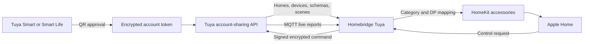

<!-- markdownlint-disable MD013 MD033 -->

<h1 align="center">Homebridge Tuya</h1>

<p align="center">
  Bring Smart Life and Tuya Smart devices into Apple Home.<br>
  QR account authorization, live cloud updates, scenes, advanced datapoint mapping, and no personal developer project required.
</p>

<p align="center">
  <a href="https://www.npmjs.com/package/@homebridge-plugins/homebridge-tuya"></a>
  <a href="https://www.npmjs.com/package/@homebridge-plugins/homebridge-tuya"></a>
  <a href="https://github.com/homebridge-plugins/homebridge-tuya/actions/workflows/build.yml"></a>
  
  
  <a href="LICENSE"></a>
</p>

<p align="center">
  <a href="https://github.com/homebridge/homebridge/wiki/Verified-Plugins"></a>
</p>

> [!NOTE]
> The QR connection supports both **Tuya Smart** and **Smart Life**. Individual users provide only the app's User Code and approve a QR code; they do not create a Tuya IoT Developer Platform project or enter an Access ID, Access Secret, country code, username, or password.

| Start here | Learn more | Get help |
| :---: | :---: | :---: |
| [🚀 Quick start](#quick-start) | [✨ Capabilities](#capabilities) | [🧰 Troubleshooting](#troubleshooting) |
| [📦 Installation](#installation) | [🏠 Supported devices](#supported-devices) | [🔐 Security](#security-and-privacy) |
| [📱 QR authorization](#qr-authorization) | [⚙️ Configuration](#configuration) | [🤝 Contribute](#development-and-contributing) |

## Why Homebridge Tuya?

Tuya devices are sold under thousands of brands and product names, but most of them expose a smaller set of standard Tuya categories and datapoints. Homebridge Tuya discovers those definitions, converts them into native HomeKit services, and keeps them updated through Tuya's cloud message stream.

The QR connection removes the most frustrating part of a traditional Tuya setup: every Homebridge user no longer needs to create, link, authorize, and periodically renew a personal Tuya cloud project. Existing `Custom` and `Smart Home` project configurations remain supported for installations that already use them or need APIs outside the account-sharing surface.

## Connection methods

| Method | Project type | User provides | Device source | Recommended for |
| --- | :---: | --- | --- | --- |
| Smart Life / Tuya Smart QR login | `3` | App, User Code, QR approval | Homes shared with the app account | Most personal installations |
| Smart Home cloud project | `2` | Access ID, Access Secret, country code, app login | Linked app account homes | Existing developer-project users |
| Custom cloud project | `1` | Endpoint, Access ID, Access Secret | Authorized project assets | Industry/custom Tuya projects |

> [!WARNING]
> QR mode currently uses Home Assistant's public Tuya authorization identity for compatibility. Authorizing the **same Tuya account** in both systems can replace or invalidate Home Assistant's existing Tuya refresh token. Your devices and Tuya Home are not deleted, but one integration may request reauthentication. The reliable coexistence setup is to share the Tuya Home with a second Smart Life or Tuya Smart account and use that second account only for Homebridge.

## Installation

Before installing, remove the old `homebridge-tuya-platform` package if it is present. Both plugins use compatible platform concepts but should not run against the same accessories simultaneously.

### Homebridge UI

1. Open **Homebridge → Plugins**.
2. Search for `@homebridge-plugins/homebridge-tuya`.
3. Install **Homebridge Tuya**.
4. Open the plugin settings and follow [Quick start](#quick-start).

### npm

```bash
npm install -g @homebridge-plugins/homebridge-tuya
```

## Quick start

1. Add and test the devices in **Tuya Smart** or **Smart Life** first.
2. In that app, open **Me → Settings → Account and Security → User Code** and copy the User Code.
3. Open Homebridge Tuya settings.
4. Select **Smart Life / Tuya Smart QR login (no developer account)**.
5. Select the exact app containing the devices and enter its User Code.
6. Select **Start QR login**.
7. Scan the new QR code with the selected app and approve the authorization.
8. Wait for **Connected**, save the configuration, and restart Homebridge.

The plugin discovers every visible Tuya Home unless `homeWhitelist` is configured. Supported devices and enabled Tap-to-Run scenes then appear as HomeKit accessories.

> [!TIP]
> Tuya QR tokens are short-lived. If the app reports that a code has expired, select **Start QR login** again and scan the newly generated code. A screenshot of an earlier QR code cannot be reused.

## Reliable coexistence with Home Assistant

Use separate app accounts when Home Assistant and Homebridge need access to the same Tuya Home:

1. Keep the primary Tuya Smart or Smart Life account connected to Home Assistant.
2. Create a second account in the same app ecosystem.
3. From the primary account, invite the second account as a member of the Tuya Home.
4. Accept the invitation and confirm that the second account can see the devices.
5. Copy the **second account's User Code**.
6. Complete Homebridge QR authorization while signed in to the second account.

Both accounts then reach the same devices, while each integration owns a different account token.

## Capabilities

| Capability | Status | Notes |
| --- | :---: | --- |
| Tuya Smart QR authorization | ✅ | No personal developer project or app password |
| Smart Life QR authorization | ✅ | Uses the same secure QR approval flow |
| Home and device discovery | ✅ | Reads all visible homes or an optional whitelist |
| HomeKit accessory mappings | ✅ | Reuses the established category handlers from the official plugin |
| Device commands | ✅ | Sends standard Tuya commands through the account API |
| Live state updates | ✅ | MQTT subscriptions for normalized and raw datapoint reports |
| Automatic token renewal | ✅ | Refreshes and atomically persists account credentials |
| Tap-to-Run scenes | ✅ | Enabled scenes appear as HomeKit switches |
| Raw datapoint conversion | ✅ | Includes Tuya's official boolean, enum, range, light, timer, lock, vacuum, and meter conversion strategies |
| Home whitelist | ✅ | Include only selected Tuya Home IDs |
| Device and schema overrides | ✅ | Rename datapoints, correct types/ranges, transform values, hide devices, or change categories |
| Developer-project modes | ✅ | Existing Custom and Smart Home configurations remain available |
| Optional weather accessory | ✅ | Open-Meteo or authorized Tuya weather data |
| Manual RTSP camera | ✅ | Add a camera stream independently of Tuya cloud discovery |
| Product-specific IR, camera, and lock APIs in QR mode | 🟡 | Discovery mappings remain, but availability depends on account-sharing permissions and the product |
| Historical energy/statistics import | ➖ | This plugin exposes current device state; it does not import Tuya app history |
| Local Tuya LAN control | ➖ | Commands and live updates require Tuya Cloud |
| Zigbee gateway replacement | ➖ | Zigbee child devices remain paired to their Tuya gateway |

## How it works



At startup, the plugin:

1. Loads the account token from Homebridge's persist directory.
2. Refreshes it when it is within one minute of expiry.
3. Fetches homes, devices, device specifications, report strategies, and scenes.
4. Converts each Tuya device into the existing internal device model.
5. Applies overrides in device, product, then global order.
6. Creates or restores stable HomeKit accessories using the Tuya device ID.
7. Opens the Tuya MQTT stream and subscribes to the selected homes and devices.

### Live datapoint reports

Tuya can send one of two report shapes:

- **Normalized reports** contain a standard datapoint code and value.
- **Raw reports** contain a numeric `dpId` and encoded value.

For raw reports, the plugin fetches Tuya's strategy metadata, converts the value, validates enum ranges, and only then updates HomeKit. Devices explicitly marked by Tuya as custom reporting types stay on normalized reporting to avoid publishing incorrectly decoded values.

MQTT credentials are short-lived. The plugin renews them before expiry, tears down the old client, and reconnects with exponential backoff after unexpected failures.

## QR authorization

### What users provide

- The app in use: `tuyaSmart` or `smartlife`
- The User Code displayed by that app
- Approval by scanning a QR code

The app username, password, Access ID, Access Secret, local key, and cloud data-center selection are not requested in QR mode.

### Compatibility identity

The default client identity and QR schema are the public values used by Home Assistant's Tuya authorization flow. Advanced builds can override them with:

- `TUYA_SHARING_CLIENT_ID`
- `TUYA_SHARING_SCHEMA`
- `options.clientId`
- `options.qrSchema`

A new identity cannot be invented locally. Tuya must issue the client ID and enable its matching QR schema for the account-sharing endpoints.

### Credential storage

QR credentials are stored outside `config.json`:

```text
<Homebridge persist path>/TuyaSharing.<user-code-hash>.json
```

The filename contains only a shortened SHA-256 hash of the User Code. The file is written atomically with owner-only permissions (`0600`). It contains the access token, refresh token, Tuya endpoint, terminal ID, account UID, app selection, and integration client ID.

## Supported devices

Support is determined by both the Tuya category and the datapoints actually exposed by a product. Two products with the same marketing name can use different schemas.

| Family | Representative category codes | HomeKit services |
| --- | --- | --- |
| Lights and dimmers | `dj`, `dsd`, `xdd`, `fwd`, `dc`, `dd`, `gyd`, `tyndj`, `sxd`, `tgq`, `tgkg` | Lightbulb, Motion Sensor |
| Switches and relays | `kg`, `tdq`, `dlq`, `qjdcz`, `szjqr` | Switch, optional energy characteristics |
| Outlets and power strips | `cz`, `pc`, `wkcz` | Outlet, temperature/humidity where exposed |
| Wireless and scene switches | `wxkg`, `cjkg` | Stateless Programmable Switch, Switch |
| Air conditioners | `kt`, `ktkzq` | Heater Cooler, Fan, Dehumidifier, sensors |
| Heating and climate | `qn`, `wk`, `wkf`, `mjj` | Heater Cooler, Thermostat |
| Fans and ceiling fan lights | `fs`, `fsd`, `fskg` | Fan, Lightbulb |
| Curtains and windows | `cl`, `clkg`, `mc` | Window Covering, Window |
| Garage doors | `ckmkzq` | Garage Door Opener |
| Air treatment | `kj`, `jsq`, `cs`, `xxj` | Air Purifier, Humidifier, Dehumidifier, Lightbulb |
| Safety sensors | `ywbj`, `rqbj`, `jwbj`, `sj`, `cobj`, `co2bj` | Smoke, Leak, Carbon Monoxide, Carbon Dioxide |
| Environment sensors | `wsdcg`, `ldcg`, `pir`, `hps`, `pm25`, `hjjcy`, `qxj` | Temperature, Humidity, Light, Motion, Occupancy, Air Quality |
| Security | `ms`, `jtmspro`, `mal`, `mcs`, `zd` | Lock, Security System, Contact, Motion |
| Cameras and doorbells | `sp`, `wxml` | Motion, Doorbell, optional stream |
| Valves and feeders | `ggq`, `sfkzq`, `cwwsq` | Valve, Switch |
| IR hubs and remotes | `wnykq`, `hwktwkq`, `wsdykq`, `infrared_*` | Sensors, Switch, Heater Cooler |
| Scenes | Virtual `scene` devices | Switch |

See [Supported Devices](SUPPORTED_DEVICES.md) for the complete category matrix and Tuya documentation links.

> [!IMPORTANT]
> A listed category means the plugin has a matching accessory handler. The product must still expose that handler's required standard datapoints. Unsupported or non-standard products can often be corrected with [device overrides](ADVANCED_OPTIONS.md).

### Energy monitoring

Supported switches, outlets, and circuit breakers can expose current, power, voltage, and total consumption when the device schema provides the corresponding standard datapoints. Standalone smart-meter products, vendor-specific three-phase payloads, historical energy archives, import/export accounting, and calculated household totals are not automatically guaranteed by the category table.

For a non-standard energy meter, first inspect its saved device schema and live datapoints. Use an override only when the conversion, scale, sign, and unit are known.

## Feature guides

### Tap-to-Run scenes

Enabled scenes from each selected Tuya Home are represented as HomeKit switches. Turning the switch on triggers the scene; the scene is an action and does not represent a persistent Tuya on/off state.

### Multi-gang switches

The standard switch and outlet handlers create services from the device's channel datapoints. A three-gang switch can therefore appear as multiple HomeKit services under one accessory when its schema uses standard channel codes such as `switch_1`, `switch_2`, and `switch_3`.

### Weather accessory

Enable `generateWeatherAccessory` to create a virtual weather accessory for a discovered home location.

| Weather source | Requirement | Notes |
| --- | --- | --- |
| `Open-Meteo` | Internet access | Intended for non-commercial use under Open-Meteo's terms |
| `Tuya` | Authorized Tuya Weather Service | Most relevant to developer-project modes |

### Cameras and RTSP

Tuya camera discovery can expose motion, doorbell, and product-dependent stream behavior. A separate RTSP camera can also be configured manually with `cameras[]`. If the URL does not already contain credentials, optional `username` and `password` values are inserted when the stream is opened.

### IR control

The inherited accessory mappings cover Tuya IR hubs, learned remotes, generic remotes, and air conditioners. These handlers use product-specific IR cloud endpoints. A device appearing in the app does not guarantee that those endpoints are granted to the QR account-sharing identity.

### Device overrides

Overrides are resolved in this order:

1. Exact device ID or UUID
2. Product ID
3. The special `global` ID

They can:

- Change an unsupported product to a compatible category
- Rename a non-standard datapoint to a standard code
- Correct Boolean, Integer, Enum, String, JSON, or Raw types
- Correct ranges, scale, step, or enum options
- Transform values with `onGet` and `onSet`
- Hide a datapoint, device, product, or scene
- Publish an accessory externally with `unbridged`
- Enable adaptive lighting on compatible lights
- Read garage-door state from `doorcontact_state`

See [Advanced Options](ADVANCED_OPTIONS.md) for complete examples and safety notes.

## Configuration

The Homebridge settings UI is the recommended configuration method because it generates and displays the authorization QR code.

### QR mode options

| Option | Default | Description |
| --- | --- | --- |
| `projectType` | — | Use `"3"` for QR account authorization |
| `userCode` | — | User Code from Account and Security in the selected app |
| `appSchema` | `"tuyaSmart"` | `"tuyaSmart"` or `"smartlife"` |
| `homeWhitelist` | all visible homes | Optional array of Home IDs to include |
| `clientId` | compatibility identity | Optional integration client-ID override |
| `qrSchema` | `haauthorize` | Optional integration QR-schema override |
| `endpoint` | Tuya QR service | Optional advanced login-endpoint override |
| `generateWeatherAccessory` | `false` | Create a virtual weather accessory |
| `weatherAPI` | `"Open-Meteo"` | Weather source when the virtual accessory is enabled |
| `forceIPv4` | `false` | Force IPv4 for legacy OpenAPI connections |
| `debug` | `false` | Enable additional diagnostic logging |
| `debugLevel` | all enabled scopes | Optional comma-separated scopes; use `api` for transport/manager diagnostics or a device ID for accessory diagnostics |

### Minimal QR configuration

```json
{
  "platform": "TuyaPlatform",
  "name": "Tuya",
  "options": {
    "projectType": "3",
    "userCode": "YOUR_APP_USER_CODE",
    "appSchema": "tuyaSmart",
    "generateWeatherAccessory": false,
    "weatherAPI": "Open-Meteo",
    "forceIPv4": false
  }
}
```

For Smart Life, change only:

```json
"appSchema": "smartlife"
```

### QR configuration with a home whitelist

```json
{
  "platform": "TuyaPlatform",
  "name": "Tuya",
  "options": {
    "projectType": "3",
    "userCode": "YOUR_APP_USER_CODE",
    "appSchema": "smartlife",
    "homeWhitelist": [
      "123456789"
    ],
    "generateWeatherAccessory": false,
    "weatherAPI": "Open-Meteo",
    "forceIPv4": false
  }
}
```

Home IDs are printed in the Homebridge log after a successful login.

### Configuration with an override

```json
{
  "platform": "TuyaPlatform",
  "name": "Tuya",
  "options": {
    "projectType": "3",
    "userCode": "YOUR_APP_USER_CODE",
    "appSchema": "tuyaSmart",
    "generateWeatherAccessory": false,
    "weatherAPI": "Open-Meteo",
    "forceIPv4": false,
    "deviceOverrides": [
      {
        "id": "TUYA_DEVICE_ID",
        "category": "kg",
        "schema": [
          {
            "code": "vendor_switch",
            "newCode": "switch_1",
            "type": "Boolean"
          }
        ]
      }
    ]
  }
}
```

### Smart Home developer project

Use `projectType: "2"` for the legacy linked-app flow. It requires:

- Tuya cloud project Access ID and Access Secret
- App account linked to the project
- Correct country code and data center
- App username and password
- `tuyaSmart` or `smartlife` app schema
- Required Tuya Cloud API subscriptions

```json
{
  "platform": "TuyaPlatform",
  "name": "Tuya",
  "options": {
    "projectType": "2",
    "accessId": "YOUR_ACCESS_ID",
    "accessKey": "YOUR_ACCESS_SECRET",
    "countryCode": 91,
    "username": "YOUR_APP_LOGIN",
    "password": "YOUR_APP_PASSWORD",
    "appSchema": "tuyaSmart",
    "generateWeatherAccessory": false,
    "weatherAPI": "Open-Meteo",
    "forceIPv4": false
  }
}
```

### Custom developer project

Use `projectType: "1"` when devices are assigned to Tuya project assets rather than an app home. The project must authorize the required assets and Industry Project APIs.

The developer-project modes commonly require these Tuya services:

- Authorization Token Management
- Device Status Notification
- IoT Core
- Industry Project Client Service for Custom projects
- IoT Video Live Stream for cameras
- IR Control Hub Open Service for IR devices
- Smart Home Scene Linkage for scenes
- Smart Lock Open Service for locks

Tuya may apply trials, expiry periods, or regional availability to these services. QR users do not maintain a personal cloud-project trial.

## Persisted data

| Data | Location | Contains |
| --- | --- | --- |
| QR credentials | `TuyaSharing.<user-code-hash>.json` | Tokens, endpoint, UID, terminal and app identity |
| Device diagnostics | `TuyaDeviceList.<uid>.json` | Devices, schemas, current status, categories, and metadata |
| Platform configuration | Homebridge `config.json` | User Code, selected app, options, and overrides |
| HomeKit accessories | Homebridge accessory cache | Stable accessory identity and service state |

The exact persist path is shown in the Homebridge log. On a standard Homebridge service installation it is usually below `/var/lib/homebridge/persist`, but the plugin always uses the path supplied by Homebridge.

> [!WARNING]
> The saved device list can contain private device IDs, location fields, IP addresses, and other metadata. Sanitize it before attaching it to a public issue. Never share the QR credential file.

## Troubleshooting

### The QR code is expired

1. Leave the old QR code closed.
2. Select **Start QR login** again.
3. Scan only the newly displayed code.
4. Confirm promptly in the selected app.

**Expected result:** the UI changes from waiting to connected and saves a fresh account token.

### The QR code scans but authorization fails

1. Confirm `appSchema` matches the app being used.
2. Re-copy the User Code from that signed-in account.
3. Confirm the account can see the intended Tuya Home and devices.
4. Generate a new QR instead of rescanning a screenshot.
5. Check that the Homebridge host can reach `apigw.iotbing.com` over HTTPS.

**Expected result:** the login response supplies a token, endpoint, terminal ID, and account UID.

### Home Assistant asks for reauthentication

Homebridge and Home Assistant likely authorized the same app account using the same compatibility identity. Complete the [second-account setup](#reliable-coexistence-with-home-assistant), reconnect Home Assistant with the primary account, then authorize Homebridge with the shared secondary account.

**Expected result:** both integrations retain independent account tokens.

### No homes or devices are found

1. Open the app with the authorized account and confirm the devices are visible.
2. Confirm the account accepted its Home membership invitation.
3. Temporarily remove `homeWhitelist` or compare its IDs with the IDs in the log.
4. Save the configuration and restart Homebridge after QR approval.
5. Confirm the gateway and child devices are online in the app.

**Expected result:** the log prints each included `home_id` followed by the discovered device count.

### A device appears as unsupported

1. Find `TuyaDeviceList.<uid>.json` using the path printed in the log.
2. Inspect the device's `category`, `product_id`, `schema`, and `status`.
3. Compare the category with [Supported Devices](SUPPORTED_DEVICES.md).
4. Confirm the required standard datapoints exist.
5. Add a category or schema override when the vendor uses equivalent non-standard codes.

**Expected result:** the device is handled by the intended accessory class after Homebridge restarts.

### A device is present but shows No Response or Unavailable

1. Confirm it is online and controllable in the Tuya app.
2. Check the Homebridge log for a missing required schema warning.
3. Confirm the device still belongs to an included Home.
4. Enable debug logging and operate the physical device or app control.
5. Check for MQTT reconnect or datapoint conversion warnings.

**Expected result:** normalized status updates reach the accessory handler and refresh HomeKit.

### Controls work but live state is delayed

1. Confirm outbound MQTT/TLS traffic is not blocked by a firewall or container policy.
2. Restart Homebridge to obtain fresh short-lived MQTT credentials.
3. Operate the device in the app and inspect debug logs for protocol `4` reports.
4. Check whether the product reports a raw `dpId` that has no known conversion strategy.

**Expected result:** app or physical changes update HomeKit without waiting for a restart.

### Values, units, or signs are wrong

Do not guess a conversion from one sample. Capture several known states, verify the device schema's scale and unit, compare raw values with the app, and determine whether the value is instantaneous, cumulative, incremental, absolute, import, or export. Then use a narrowly scoped device override.

For multi-phase meters, validate every phase independently. A negative active-power value can represent direction, a reversed current transformer, or vendor-specific encoding; it is not universally safe to invert.

### A scene appears to stay on

Tap-to-Run scenes are momentary actions represented through a HomeKit switch. They do not have a durable on/off state in Tuya. Treat the switch as a trigger.

### IR, camera, or lock features are missing in QR mode

The device-sharing API can discover the base device while denying a separate product-specific API. Confirm the feature works in the Tuya app, review the log for the rejected endpoint, and test the developer-project connection if that service is essential.

### Developer-project login returns `1106` or `2406`

1. Confirm the app account is linked to the cloud project.
2. Select the data center containing that app account.
3. Verify the country code, app schema, username, and password.
4. Open **Me → Settings → Network Diagnosis** in the app and inspect the uploaded log's region code.
5. Set the endpoint manually only when automatic regional selection is wrong.

### Devices are duplicated after migration

Do not run this plugin and `homebridge-tuya-platform` simultaneously. Stop the old plugin first. Back up Homebridge before removing stale cached accessories, and remove only the affected Tuya accessories through the Homebridge UI.

## Security and privacy

- QR mode never asks for the app account password.
- API parameters and bodies are protected with AES-128-GCM using per-request nonces.
- Requests are authenticated with Tuya's HMAC-SHA256 signing scheme.
- Account tokens are stored outside `config.json` with `0600` permissions.
- Token updates use a unique temporary file and atomic rename.
- Concurrent requests share a single token refresh operation.
- MQTT credentials are short-lived and are replaced before expiry.
- The plugin adds no analytics or telemetry.
- Tuya commands, state, schemas, and scenes necessarily pass through Tuya Cloud.
- Open-Meteo receives home coordinates only when its weather accessory is enabled.

> [!WARNING]
> Never publish a QR token, access token, refresh token, credential file, local key, unsanitized device list, Homebridge backup, or full debug log.

## Limitations

- Internet access and Tuya Cloud availability are required.
- The plugin does not speak Tuya's local LAN protocol.
- It does not directly replace or re-pair a Tuya Zigbee gateway.
- Tuya app energy history and cloud statistics are not imported.
- Product support depends on category, schema, firmware, account permissions, and HomeKit's available service model.
- Home Assistant compatibility identity reuse can cause token conflicts when the same app account is authorized twice.
- One custom client ID and QR schema can be configured, but Tuya must issue and enable that identity.

## Diagnostics and issue reports

Before opening an issue, include:

- Plugin, Homebridge, Node.js, and operating-system versions
- Connection method: QR, Smart Home, or Custom
- App: Tuya Smart or Smart Life
- Device manufacturer, model, product ID, and category
- Relevant schema and status entries from the sanitized device list
- A short sanitized log covering startup and one device action
- Whether control works in the Tuya app

Remove or replace:

- Access and refresh tokens
- Access ID and Access Secret
- Device IDs and UUIDs when privacy matters
- User Code and account UID
- IP, latitude, longitude, local key, and terminal ID
- Camera URLs and credentials

## Development and contributing

Issues and pull requests are welcome.

### Development setup

```bash
git clone https://github.com/homebridge-plugins/homebridge-tuya.git
cd homebridge-tuya
npm install
npm run lint
npm run build
npm test -- --runInBand
npm audit --omit=dev
npm pack --dry-run
```

The automated tests cover:

- Existing HomeKit accessory behavior
- QR creation, polling, expiry, and both app selections
- Byte-for-byte crypto vectors generated with Tuya's official sharing SDK
- Request signing, encryption, response decryption, and concurrent token refresh
- Owner-only atomic credential persistence
- Raw datapoint conversion strategies
- Device normalization and report-strategy selection
- Protocol `4` status updates and protocol `20` device events
- Home Assistant compatibility defaults and integration-identity overrides

### Architecture

| Component | Responsibility |
| --- | --- |
| `TuyaSharingAuth` | QR authorization and secure credential persistence |
| `TuyaSharingAPI` | Encrypted, signed account API requests and token renewal |
| `TuyaSharingMQ` | Live MQTT credentials, subscriptions, renewal, and reconnects |
| `TuyaSharingStrategy` | Raw datapoint conversion compatible with Tuya's sharing SDK |
| `TuyaSharingDeviceManager` | Homes, devices, schemas, commands, scenes, and message normalization |
| `AccessoryFactory` | Tuya category to HomeKit accessory mapping |

## Project lineage and attribution

Homebridge Tuya is derived from [`0x5e/homebridge-tuya-platform`](https://github.com/0x5e/homebridge-tuya-platform) and maintained in the [`homebridge-plugins/homebridge-tuya`](https://github.com/homebridge-plugins/homebridge-tuya) project.

The QR account-sharing transport and raw datapoint conversion behavior are based on Tuya's MIT-licensed [`tuya-device-sharing-sdk`](https://github.com/tuya/tuya-device-sharing-sdk). See [Third-party Notices](THIRD_PARTY_NOTICES.md).

### Account-sharing extension

<table>
  <tr>
    <td width="150" align="center" valign="top">
      <a href="https://www.tharunpkarun.com">
        
      </a>
      <br>
      <a href="https://github.com/tharunpkarun"><code>@tharunpkarun</code></a>
    </td>
    <td valign="top">
      <h3>Tharun P Karun</h3>
      <p><strong>Founding Engineer &amp; AI Architect · Engineering Leader · Systems Builder</strong></p>
      <p>
        I build AI-first products and scalable, human-centered systems. My work spans engineering leadership,
        system architecture, and career-tech platforms adopted by more than one million users.
      </p>
      <p>Kerala, India</p>
    </td>
  </tr>
</table>

<p align="center">
  <a href="https://www.tharunpkarun.com"></a>
  <a href="https://github.com/tharunpkarun"></a>
  <a href="https://linkedin.com/in/tharunpkarun"></a>
</p>

| Discover more | Read and explore | Connect |
| :---: | :---: | :---: |
| [About me](https://www.tharunpkarun.com/about) | [Blog](https://www.tharunpkarun.com/blog) | [Contact](https://www.tharunpkarun.com/contact) |
| [Projects](https://www.tharunpkarun.com/projects) | [Home Lab](https://www.tharunpkarun.com/homelab) | [X / Twitter](https://twitter.com/tharunpkarun) |

## License

This project is available under the [MIT License](LICENSE). See [Third-party Notices](THIRD_PARTY_NOTICES.md) for the Tuya Device Sharing SDK attribution.

<p align="center">
  <a href="https://www.npmjs.com/package/@homebridge-plugins/homebridge-tuya">npm</a> ·
  <a href="https://github.com/homebridge-plugins/homebridge-tuya/issues">Issues</a> ·
  <a href="https://github.com/homebridge-plugins/homebridge-tuya/pulls">Pull requests</a> ·
  <a href="CHANGELOG.md">Changelog</a>
</p>
